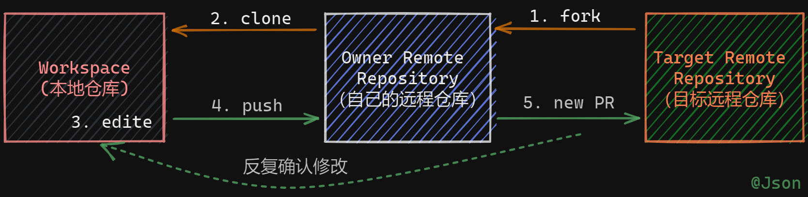
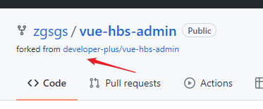
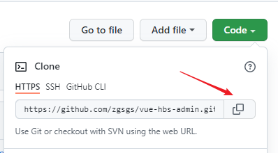
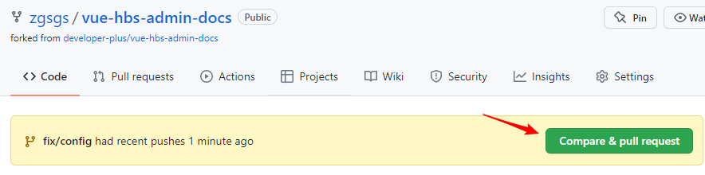
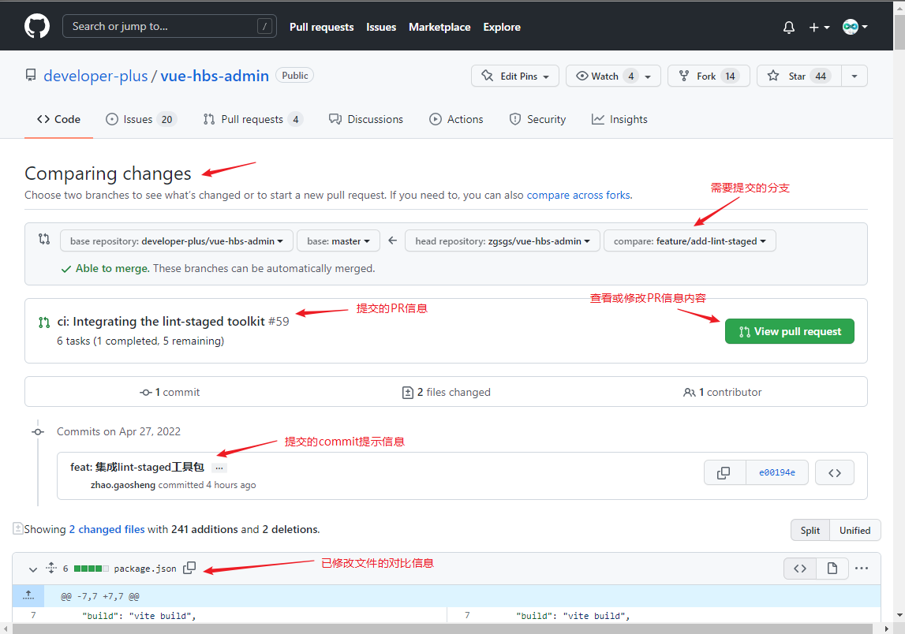
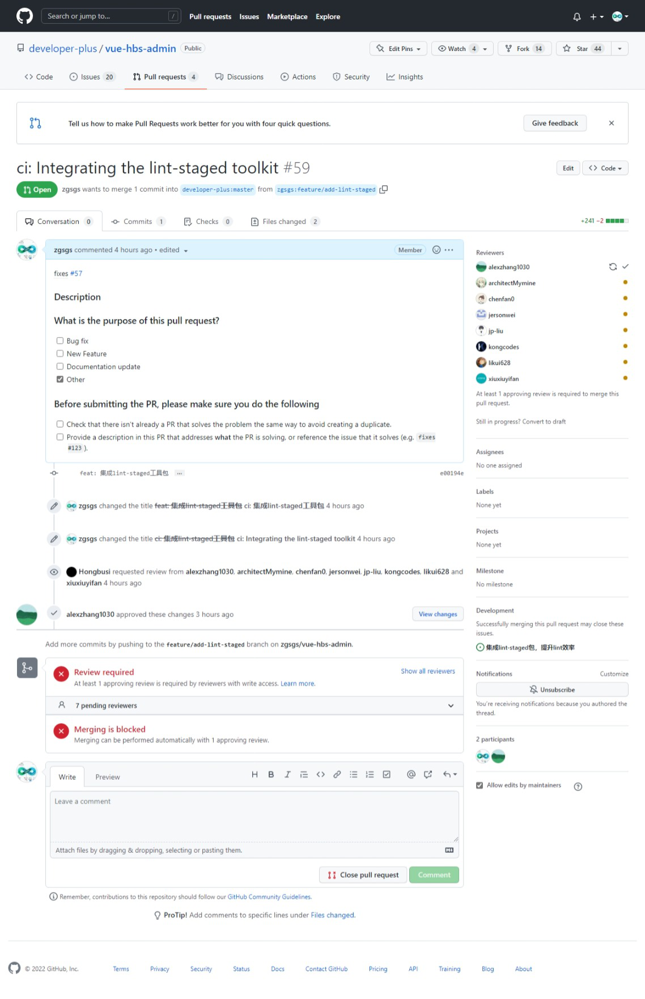

# 如何在 GitHub 上给项目提 **PR**（Pull Request）

## 1. Fork Repository

先把需要提 **PR** 的仓库 Fork 到自己的远程仓库

## 2. Clone Repository

把 Fork 到的仓库，从自己的远程仓库Clone到本地

## 3. Edit Code

编辑需要 **PR** 的代码。这里最好新建一个分支进行提交。

## 4. Push

将编辑好的代码提交到你的远程仓库

## 5. New Pull Request

**方式一**

当修改代码提交后，自己 Fork 的仓库中会出现 New Pull Request 的提示信息，点击 New Pull Requests 按钮，进入 Comparing changes 界面。

**方式二**

还可以通过点击 Pull Requests -> New pull requests 按钮进入 Comparing changes 界面。

此时我们需要选择自己的仓库需要提交的分支

## 6. Review Pull Request

新建 **PR** 后，需要管理员进行 Review，这个过程往往需要反复几次意见修改才能通过

## 7. Merge Pull Request

通过后的 **PR** 将被管理员合并到主分支。完成 **PR** 操作。

