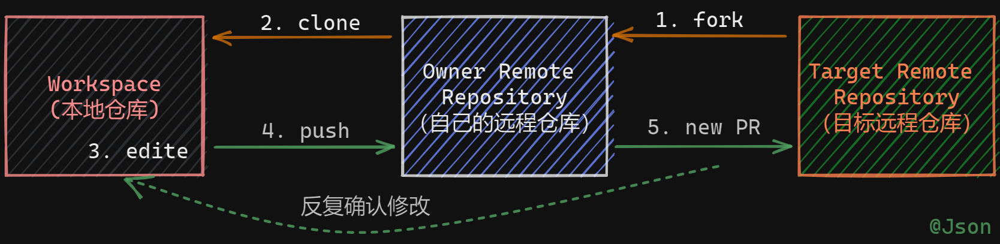
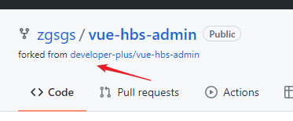
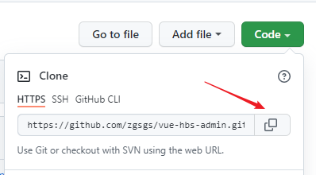
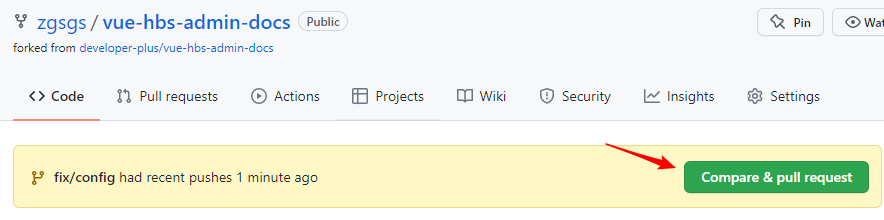
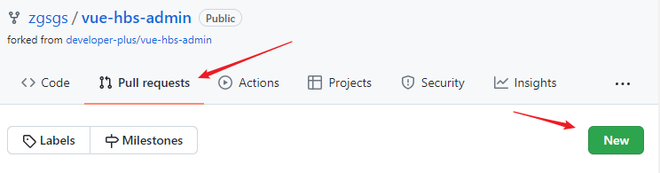
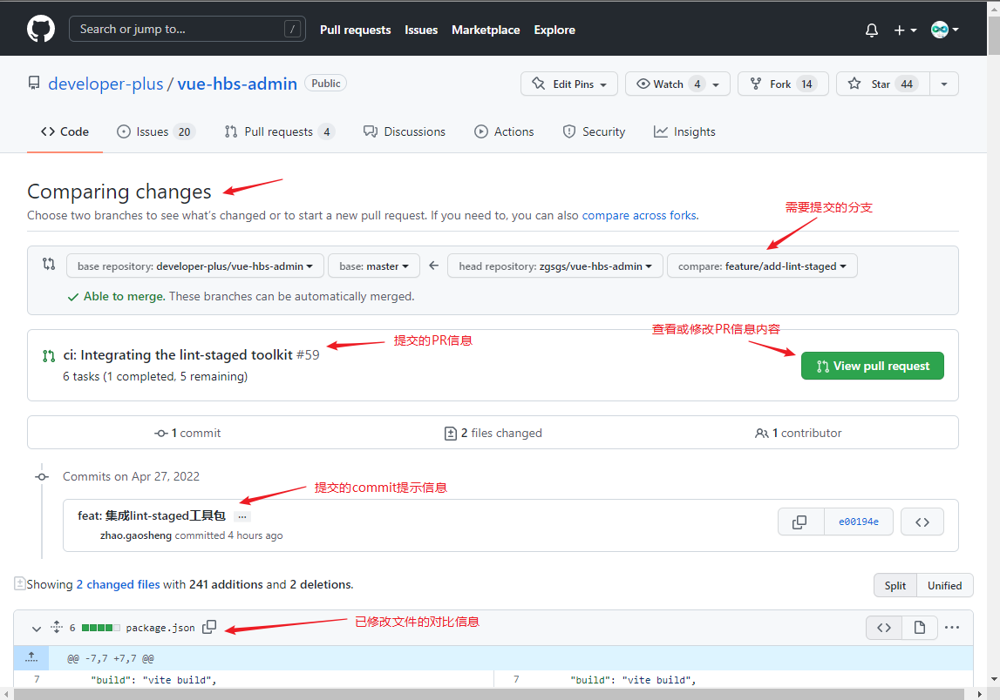
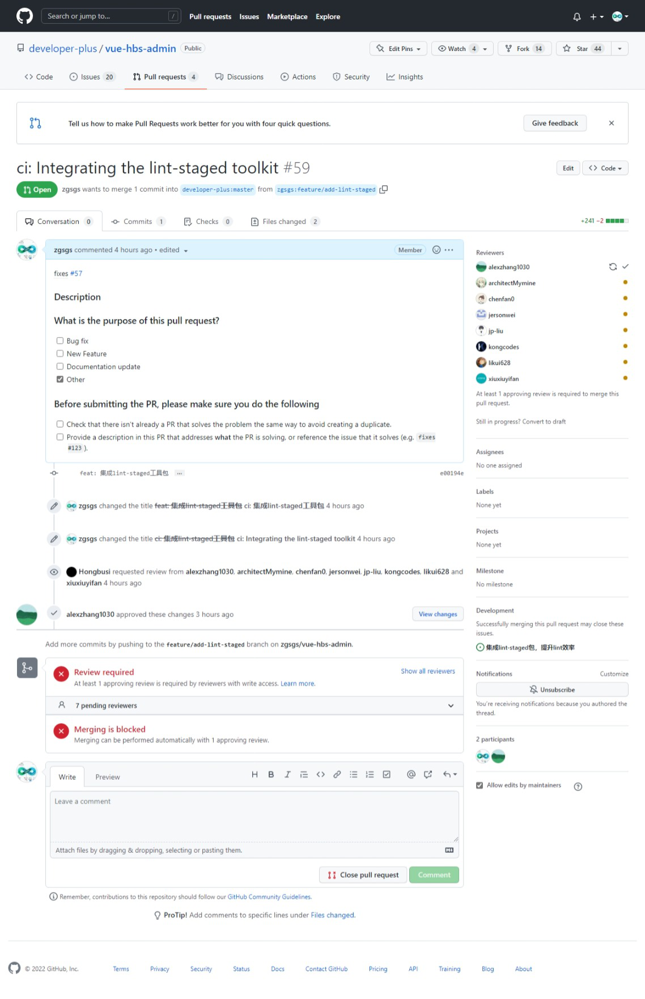

# 如何在GitHub上给项目提PR（Pull Request）

## 基本步骤

### 1. Fork Repository

先把需要提PR的仓库Fork到自己的远程仓库

### 2. Clone Repository

把Fork到的仓库，从自己的远程仓库Clone到本地

### 3. Edit Code

编辑需要PR的代码。这里最好新建一个分支进行提交。

### 4. Push

将编辑好的代码提交到你的远程仓库

### 5. New Pull Request

方式一：
当修改代码提交后，自己Fork的仓库中会出现New Pull Request的提示信息，点击New Pull Requests按钮，进入Comparing changes界面。

方式二：
还可以通过点击Pull Requests->New pull requests按钮进入Comparing changes界面。

此时我们需要选择自己的仓库需要提交的分支

### 6. Review Pull Request

新建PR后，需要管理员进行Review，这个过程往往需要反复几次意见修改才能通过

### 7. Merge Pull Request

通过后的PR将被管理员合并到主分支。完成PR操作。

